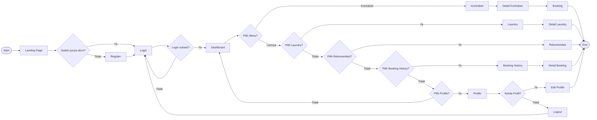

# Flowchart User (Mobile)

Berikut flowchart user versi ringkas (simpel, decision 2 arah).


```mermaid
flowchart LR
  Start([Start]) --> Landing[Landing Page]
  Landing --> HasAccount{Sudah punya akun?}
  HasAccount -->|Ya| Login[Login]
  HasAccount -->|Tidak| Register[Register]
  Register --> Login

  Login --> LoginOk{Login sukses?}
  LoginOk -->|Tidak| Login
  LoginOk -->|Ya| Dashboard[Dashboard]

  Dashboard --> Menu{Pilih Menu?}
  Menu -->|Kontrakan| KontrakanList[Kontrakan]
  Menu -->|Lainnya| PickLaundry{Pilih Laundry?}
  PickLaundry -->|Ya| LaundryList[Laundry]
  PickLaundry -->|Tidak| PickRekom{Pilih Rekomendasi?}
  PickRekom -->|Ya| Recommendations[Rekomendasi]
  PickRekom -->|Tidak| PickBooking{Pilih Booking History?}
  PickBooking -->|Ya| BookingHistory[Booking History]
  PickBooking -->|Tidak| PickProfile{Pilih Profile?}
  PickProfile -->|Ya| Profile[Profile]
  PickProfile -->|Tidak| Dashboard

  KontrakanList --> KontrakanDetail[Detail Kontrakan]
  KontrakanDetail --> Booking[Booking]
  Booking --> End([End])

  LaundryList --> LaundryDetail[Detail Laundry]
  LaundryDetail --> End

  Recommendations --> End

  BookingHistory --> BookingDetail[Detail Booking]
  BookingDetail --> End

  Profile --> ProfileAction{Kelola Profil?}
  ProfileAction -->|Ya| EditProfile[Edit Profile]
  ProfileAction -->|Tidak| Logout[Logout]
  EditProfile --> End
  Logout --> Login
```
```
